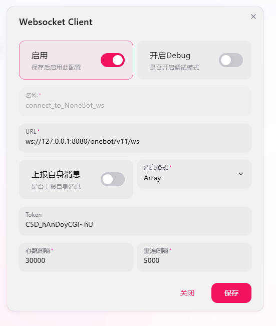

<div align="center">
  <div style="display: flex; align-items: center; justify-content: center; gap: 12px;">
    
    <h1 style="font-size: 3em; margin: 0; line-height: 1.2;">ClassBridge</h1>
  </div>
  <p style="font-size: 1.3em; color: #666; margin-top: -6px; margin-bottom: 20px;">
    教室 QQ 消息投屏系统
  </p>
  <p>
    <a href="LICENSE"></a>
    &nbsp;
    <a href="https://www.python.org/"></a>
    &nbsp;
    
    &nbsp;
    
  </p>
</div>

家长在 QQ 群里发消息，实时转发到教室大屏幕上。支持消息优先级（普通 / 紧急）、已读回执、撤回、重发、考试静默模式、课间自动弹窗、管理员（科任老师）私聊。

---


## 架构

```
家长 QQ 群 → NapCat/NoneBot → WebSocket Server → 教室电脑客户端
                 ↑                                     │
                 └──────── 已读回执 ←───────────────────┘
```

三组件各自独立部署：

| 组件         | 目录                      | 运行位置             |
|------------|-------------------------|------------------|
| **Server** | `server/`               | 服务器（公网可达）        |
| **Client** | `client/`               | 教室电脑（Windows）    |
| **Plugin** | `Nonebot/kgGao29Robot/` | 服务器（与 NapCat 同机） |

## 快速开始

### 推荐环境（即开发环境，其它环境我没测过不知道）

- Python 3.9
- Windows 10 22H2（Client 端）、 Windows Server 2022（Nonebot及Server端）

---

### 1. Server（消息中转服务器）

```bash
# 进入项目目录
cd kegao_qq_bot_codex

# 安装依赖
pip install websockets==11.0.3 sqlalchemy

# 复制并编辑配置文件
cp configs/server.example.toml configs/server.toml
# 编辑 configs/server.toml：
#   - 修改 internal_token 为一个随机字符串
#   - host 保持 127.0.0.1（仅本机监听）
#   - 如需直连可改为 0.0.0.0，但仅建议内网使用

# 启动
python -m server
```

服务启动后监听 `ws://127.0.0.1:8765`，提供两个 WebSocket 端点：
- `/ws/client` — 教室客户端
- `/ws/plugin` — QQ 机器人插件

**注意：** `server` 应当运行于具有公网IP的服务器上，且服务器不可停机，否则将会导致消息丢失

---

### 2. Client（教室桌面客户端）

```bash
# 安装依赖
pip install -r client/requirements.txt

# 复制并编辑配置文件
cp configs/client.example.toml configs/client.toml
# 编辑 configs/client.toml：
#   - internal_token：与 server.toml 保持一致
#   - server_ws_url：指向 server 的公网地址，如 ws://你的服务器IP:8765/ws/client
#   - 按需修改 [client] 和 [schedule] 下的设置项

# 启动
python -m client
```

客户端启动后：
- 最小化到系统托盘（关闭窗口不会退出）
- 课间时间（按 `[schedule]` 配置）自动弹出未读消息
- 紧急消息弹出模态对话框强制提醒

**考试模式**：在设置页勾选后，标题栏显示 🌙，暂停自动弹窗。

**访问验证**：修改服务器地址等敏感设置需输入验证密码。验证密码和验证服务地址在配置文件 `[challenge]` 段中设置。 

验证服务是一个Flask编写的服务器，以下是一个简单的示例：
```python
from flask import Flask, request, jsonify, render_template
import random

QUESTION_POOL = [
    {"id": 1, "q": "问题1", "a": "答案1"},
    {"id": 2, "q": "问题2", "a": "答案2"},
    {"id": 3, "q": "问题3", "a": "答案3"}
]

app = Flask(__name__)

def pick_random_question():
    chosen = random.choice(QUESTION_POOL)
    return {"id": chosen['id'], "q": chosen['q']}
    
# 通过 /challenge 获取问题id及题目
@app.route('/challenge', methods=['GET'])
def challenge():
    q = pick_random_question()
    return jsonify({"status": "success", "id": q['id'], "question": q['q']}), 200

# 通过 /verify 验证答案是否正确
@app.route('/verify', methods=['POST'])
def verify():
    data = request.get_json(force=True, silent=True) or {}
    qid = data.get('id')
    answer = data.get('answer', '')

    if qid is None or not isinstance(qid, int):
        return jsonify({"status": "error", "message": "缺少问题 id"}), 400

    question = next((q for q in QUESTION_POOL if q['id'] == qid), None)
    if not question:
        return jsonify({"status": "error", "message": "无效的问题 id"}), 400

    if str(answer).strip().lower() == str(question['a']).strip().lower():
        return jsonify({
            "status": "success",
            "message": "验证通过"
        }), 200
    else:
        return jsonify({"status": "error", "message": "答案错误"}), 403
    
if __name__ == '__main__':
    app.run(host='0.0.0.0', port=6666)  # 此处端口号应与 client.toml 中的 challenge_url 及 verify_url 一致

```

---

### 3. Plugin（NoneBot QQ 机器人）

#### 3.1 安装 NapCat

前往 [NapCat 官方仓库](https://github.com/NapNeko/NapCatQQ) 下载对应环境的一键包并按照指引安装。

#### 3.2 配置 NapCat

有关自动登录、密码、插件等按需配置即可，此处主要强调网络配置。请在 NapCat 主界面中依次点击：`网络配置`-`新建`-`Websocket客户端`，并参考 `Nonebot/appsettings.json` 中定义的连接方式及端口号：

```json
{
    "Implementations": [
        {
            "Type": "ReverseWebSocket",
            "Host": "127.0.0.1",
            "Port": 8080,
            "Suffix": "/onebot/v11/ws",
            "ReconnectInterval": 5000,
            "HeartBeatInterval": 5000,
            "AccessToken": ""
        }
    ]
}
```

如无特殊需求，与本项目保持一致即可，则可按下图所示进行配置：



**（启用按钮一定要打开！！！）**

#### 3.3 安装并配置 NoneBot

```bash
cd Nonebot/kgGao29Robot

# 创建虚拟环境
python -m venv .venv
.venv\Scripts\activate

# 安装框架
pip install nonebot2 nonebot-adapter-onebot websockets

# 复制并编辑配置文件
cp ../../configs/plugin.example.toml ../../configs/plugin.toml
# 编辑 configs/plugin.toml：
#   - internal_token：与 server.toml 保持一致
#   - server_ws_url：指向 server，如 ws://127.0.0.1:8765/ws/plugin
#   - class_group_ids：监听的 QQ 群号列表
#   - admin_users：管理员的 QQ 号列表

# 启动
nb run
```

---

### 部署拓扑建议

```
┌───────────────── 服务器 ────────────────────┐
│                                            │
│  NapCat ←── QQ 协议 ──→ QQ 服务器            │
│    │                                       │
│    └── ReverseWS → NoneBot 插件             │
│                       │                    │
│                       ↓ /ws/plugin         │
│                   Server (:8765)           │
│                       ↑                    │
│                   /ws/client               │
└───────────────────────┼────────────────────┘
                        │
      教室电脑 Client ────→ ws://服务器IP:8765/ws/client
```

建议用 Nginx 反向代理 WebSocket 端口并配置 SSL。

---

### 服务启动顺序建议
1. 启动 server （在项目根目录运行 python -m server）

2. 启动 NoneBot （进入机器人文件夹并运行 nb run）

3. 启动 NapCat （napcat.quick.bat）
   
<details>
  <summary>为什么是这个顺序</summary>
  Napcat 一启动就会疯狂重连 NoneBot，NoneBot 一启动就会疯狂重连 server

  我看着重连信息刷屏感觉很烦，于是便有了上面的顺序
</details>


---

## 家长使用说明（给群里的使用指引）

在班级 QQ 群 **@机器人** 发送消息：

```
@机器人 明天记得带美术用品

@机器人 /紧急消息 孩子发烧了，请到校门口来接
```

可用指令：

| 指令            | 说明           |
|---------------|--------------|
| `/帮助`         | 查看帮助信息       |
| `/查询` 或 `/cx` | 查看已发送消息的阅读状态 |
| `/撤回 编号`      | 撤回未读消息       |
| `/重发 编号`      | 重发未读消息       |

---

## 配置说明

详细配置项见各 `.example.toml` 模板文件。

**重要**：三个配置文件中的 `internal_token` 必须一致，这是组件间认证凭据。

---

## 许可证

MIT
