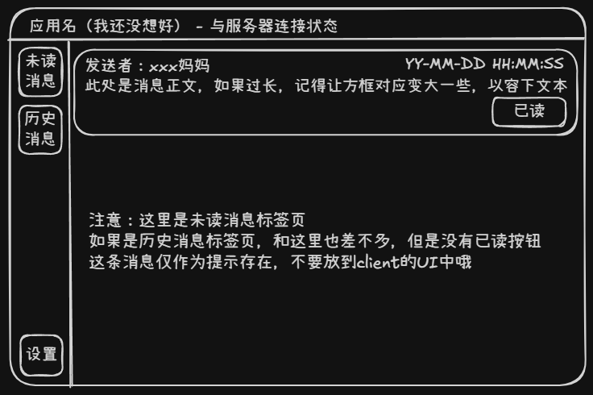

# Conversation

**Date**: June 21, 2026 at 02:32 AM

**Turns**: 4

**Source**: [Gemini Chat](https://gemini.google.com/)

---

## Turn 1

### 👤 User

现在我们要来开发一个家校沟通QQ机器人项目，依赖的外部项目有Nonebot以及Napcat

该项目旨在及时将家长发在qq群的消息展示给校园里的同学看，主要由三部分组成：①message_handler_plugin.py，部署于服务器，开发阶段部署在本地，负责处理机器人接收到的消息，并转给消息服务器；②message_server.py，部署于服务器，开发阶段部署在本地，作为消息服务器，负责将plugin中处理完的消息储存，并用WS转发到客户端，选用flask框架，database储存数据；③client.py，客户端软件，pyqt6+FluentUI开发

通过Napcat实现登录QQ账号（该账号专门用于机器人），并用WS连接至Nonebot，依托Nonebot的插件功能，实现自定义处理机器人接收到的消息

接下来，我们一起讨论项目的细节，你可以询问我你不懂的地方，也可以提建议。最后，我们将生成三个文档，分别是PRD、UI文档以及技术文档，然后我会提供给Cursor进行代码编写

### 🤖 Assistant

太棒了！这是一个非常有意义的项目。对于在校不能频繁使用手机、但需要获取家庭紧急信息的同学来说，这简直是“刚需”。你的技术选型（Nonebot + NapCat + Flask + PyQt6）非常扎实，分层也很清晰。
为了确保后续生成的 PRD、UI 文档和技术文档能直接喂给 Cursor 并产生高质量代码，我们需要先把一些核心逻辑和边界情况理清楚。
以下是我对该架构的一些洞察和需要向你确认的细节：

### 1. 核心链路细节确认

- **消息流转协议：**
  - `plugin` -> `server`：你是倾向于使用 **HTTP POST** 还是 **WebSocket**？（建议：如果只是上报，HTTP 足够；如果需要实时双向通信，则选 WS）。
  - `server` -> `client`：你提到用 WS，对于 Flask 来说，**Flask-SocketIO** 是最常用的选型，你是否接受？
- **身份识别与绑定：**
  - 机器人接收到的群消息成千上万，如何判断哪条消息是给哪个同学的？
  - 是需要一个“绑定关系表”（例如：QQ号 A 是 同学甲 的家长）？还是简单粗暴地展示所有群消息？
- **多媒体支持：**
  - QQ 消息里经常有图片、语音或表情包。目前的规划是只转发**纯文本**，还是需要处理 **图片/文件**？（这涉及到服务器存储图片和客户端渲染图片的逻辑）。

### 2. 技术架构建议

- **数据库选型：**
  - 既然是 Flask 架构，建议使用 **SQLite**（轻量，部署方便）配合 **SQLAlchemy**。如果消息量巨大，再考虑 PostgreSQL。
- **消息状态管理：**
  - 客户端是否需要“已读/未读”状态？
  - 是否需要“历史记录回溯”功能？（即客户端登录时，自动拉取最近 50 条消息）。
- **安全性：**
  - `plugin` 向 `server` 发送数据时，建议加一个简单的 `API_KEY` 验证，防止接口被恶意灌水。
  - 客户端连接 WS 时，是否需要账号密码登录？

### 3. UI/UX 设想（针对 PyQt6 + FluentUI）

- **展示形式：**
  - 是类似“通知中心”的瀑布流，还是类似“聊天窗口”的对话界面？
  - 考虑到是“家校沟通”，是否需要一个**紧急消息提醒**（比如家长发了关键词“紧急”，客户端弹出置顶弹窗）？

### 我们接下来的行动路径
为了高效生成文档，我建议按以下顺序推进：

1. **第一步：** 你回答上述关于**业务逻辑**（绑定关系、图片支持、已读状态）的问题。
2. **第二步：** 我为你草拟 **PRD（需求止损文档）**。
3. **第三步：** 我们细化 **UI 交互流程** 和 **API 接口定义（技术文档核心）**。
**你会希望机器人支持“多对多”模式吗？（即一个机器人服务多个班级群，并准确投递给对应的学生客户端）**

## Turn 2

### 👤 User

*[This turn includes uploaded images]*



你的细节考虑非常到位，接下来我一一回答：

1.消息协议方面，plugin到server，server到client都用WS，因为要实现已读、撤回、重发、考试模式功能，下文我会详细介绍这些个功能

2.plugin中通过sender_name = event.sender.card or event.sender.nickname即可获取发送者名称，后续无论是db存储还是client显示，都用这个sender_name。鉴权方面是重中之重，该机器人仅接收特定群号的信息（CLASS_GROUP_IDS = ["我是群号"]）。下文会提到私聊、撤回、重发、查询消息接收等功能，这些的鉴权也应慎重考虑，我们可以详细聊聊

3.暂时不考虑多媒体支持，仅处理文本类信息，不过注意防范sql注入以及不规范/有恶意的html等信息

4.db就用SQLite吧

5.关于已读

我的设想是，家长在qq群艾特机器人发送消息，可以有普通消息和紧急消息两种。普通消息直接艾特机器人并附上消息内容即可发送，紧急消息需要艾特机器人并用“/紧急消息 f{文本内容}”的方式触发。普通消息展示在客户端窗口中（未读消息标签页的UI设计草图如图一），紧急消息以fluent弹窗形式展示，不展示于未读消息标签页中，但是展示于历史消息标签页中，无论哪种消息，在客户端都会配有一个已读按钮，按下按钮就会通知server，进而通知plugin，告诉它信息已经被学生确认读取，然后plugin就会发送一个已读回执给家长，格式为：引用消息内容，艾特家长，告诉Ta Ta的消息已经被接收。另外，如果客户端处于考试模式或者未上线，家长发消息时也要提醒家长客户端此时的状态特殊，可能没法及时接收到消息

6.不需要历史记录回溯，客户端可以储存历史消息，但是设计成可以仅保留一定时间范围内的消息，通过设置选择。可以设置永久保留、保留1年/半年/三个月/一个月等选项

7.plugin和server部署在同一个服务器中，能不能让他们之间的连接是内部连接，这样应该就没有被外部恶意灌水的可能了吧

8.应用启动后会常驻托盘，关闭应用后的首次打开应用，如果没有未读消息，就隐藏主窗口，可以通过托盘打开主窗口。如果有新消息，且符合时间表中规定的时间（非上课时间），则允许窗口弹出。任何时候，有新普通消息时，都要考虑是否在时间表规定时间内才能弹出，但紧急消息没有这方面的考虑，一旦接收到，立即弹窗展示紧急消息，但是不要打开主窗口

时间表记录的都是可弹窗的时间，格式如下：

```json
{
"breaks": [
    {"start": "08:45", "end": "08:54"},
    {"start": "09:40", "end": "09:49"}
    ]
}
```

9.关于撤回、重发、帮助、查询这些机器人命令，以及考试模式、私聊的说明：

艾特机器人并使用“/查询”or“/cx”即可查询发送消息用户所发的所有消息中未读的部分，并展示，展示格式你来决定。每个未读消息可以有一个短id，用户只需在5分钟内艾特机器人并输入“/撤回 短id”或“/重发 短id”，即可撤回（注意，不是在群里撤回，而是不展示在客户端中，但是服务器中的记录不要删掉）或重发（重发不是再发一遍，而是把信息在客户端中顶上去。并且客户端需要显示该消息已重发了多少次，初次发送及重发都是什么时候）。注：短id只是我的一种想法，你如果有更好的，可以提出

艾特机器人并“/帮助”即可获得帮助文档，你先帮我写一版，然后我再在代码中优化

考试模式：我们会进行考试，考试的时间表略有不同，且在我们考场的不一定是我们班的学生，所以使用考试模式让客户端保持静默。同时，该模式的开启需要让家长也知道

私聊：老师可以通过私聊的方式发送普通消息或紧急消息，有权限的qq号为：ADMIN_USERS = ["我是管理员", "我也是管理员"]

你需要理解我的想法，看看我的这些初步的思路有没有什么问题，然后特别关注鉴权、UI设计方面的问题。欢迎你提出问题以及建议，因为我的初步思路还很潦草，很多东西肯定也没考虑到。我们继续讨论，直到项目的设计差不多了，就可以生成三个文档，交给cursor了。辛苦了

### 🤖 Assistant

你的思路非常清晰，UI 草图直观且符合“效率工具”的定位。通过 **WS (WebSocket)** 实现全链路实时双向通信是非常明智的选择，这能保证“已读回执”和“消息撤回”几乎零延迟。
针对你的细节，我从**逻辑闭环、安全性、UI 体验**三个维度给出了深度建议和优化方案：

### 1. 核心逻辑优化建议

#### A. 关于“短 ID”机制
在 QQ 群内通过命令操作消息，短 ID 是必须的。

- **建议：** 使用 **4 位数字**（如 `1024`）。服务器在存储每条消息时生成一个当日唯一的短 ID。
- **有效期：** 短 ID 建议仅在 24 小时内有效，过期释放，避免数字过长不便输入。
- **重发逻辑：** “重发”在客户端置顶时，建议在 UI 上增加一个 **“催促次数”** 的小图标或角标，让同学一眼看出这是家长在急着找人。

#### B. 考试模式与状态反馈
家长最担心的是“消息发了没看到”。

- **逻辑：** 机器人应具备“状态自动回复”能力。
- **触发：** 当管理员输入 `/考试模式 开启` 后，任何家长在群里艾特机器人发消息，机器人**自动秒回**：“[考试模式] 当前学生正在考试/闭卷状态，客户端已静默。您的消息已存入后台，将在考试结束后（预计 XX:XX）提醒同学。”

#### C. 消息撤回的“视觉补偿”

- **建议：** 当家长在 QQ 使用 `/撤回` 命令后，Server 推送给 Client 一个 `type: recall` 的信号。
- **UI 处理：** 不要直接让消息消失（防止同学看到一半莫名其妙），而是将该消息卡片变为**灰色高透状态**，并显示“家长已撤回”。

### 2. 安全性与鉴权方案

- **Plugin 与 Server 的内部连接：**
  - 即使在同一台机器，也建议在 WS 连接握手时校验一个 `INTERNAL_TOKEN`（在环境变量中配置）。这样即使服务器防火墙误开了端口，外部连接也无法接入。
- **私聊鉴权：**
  - 针对 `ADMIN_USERS`，可以实现更高级的指令，例如远程切换客户端状态（比如帮学生远程开启/关闭考试模式）。
- **防注入：**
  - 由于是 PyQt 渲染，如果是使用 `QLabel` 或 `TextBrowser`，要注意转义 HTML 特殊字符（`<`, `>`, `&` 等），防止家长通过发送包含 HTML 标签的消息破坏客户端排版。

### 3. UI/UX 设计建议（基于 FluentUI）

- **紧急消息（Urgent）：**
  - **建议：** 使用 FluentUI 的 **InfoBar (Message Bar)** 挂载在屏幕顶部，或者使用 **TeachingTip**。
  - **强交互：** 紧急消息弹窗时，可以伴随一个特定的系统提示音。
- **时间表控制：**
  - 如果在“非弹窗时间”收到普通消息，托盘图标可以闪烁，但主窗口不跳出。
  - **建议功能：** 客户端增加一个“一键查看当前课间所有消息”的汇总按钮。
- **状态栏：**
  - 在 UI 顶部增加一个状态栏，实时显示：`[在线/考试模式/离线]`、`[服务器连接正常]`。

### 4. 机器人帮助文档（草案）
你可以直接基于这个版本进行微调：

🏠 家校沟通机器人助手说明书
1. 发送消息普通消息： @机器人 [消息内容]（示例：@机器人 记得吃感冒药）紧急消息： @机器人 /紧急消息 [消息内容]（示例：@机器人 /紧急消息 晚饭后在南门等我）
2. 消息管理查询未读： /查询 或 /cx（查看孩子还未读的消息及对应 ID）撤回消息： /撤回 [短ID]（5分钟内有效，客户端将标记为撤回）重发消息： /重发 [短ID]（提醒孩子该事很急，客户端将置顶显示）
3. 自动反馈当孩子点击“已读”按钮，您将收到一条艾特回执。若孩子处于“考试模式”或“非课间休息”，我会自动告知您当前状态。
4. 管理员功能（限老师）/考试模式 开启/关闭：控制学生端进入静默状态。

### 5. 关于项目的下一步提问
为了完善技术文档，我还需确认两个技术小点：

1. **客户端心跳：** 我们是否需要 Server 监测 Client 的在线状态？（如果 Client 断网了，家长发消息时，机器人是否应该提示“学生端当前离线”？）
2. **多群逻辑：** 虽然目前只接收一个群，但 Server 的数据库设计是否需要预留“群号”字段，以便未来扩展给多个班级使用？
3. **时间表存储：** 时间表是写死在 Client 本地，还是由 Server 统一管理下发？（建议 Server 管理，方便统一调整全校课表）。
**如果你觉得上述思路没问题，请告诉我，我们将开始生成第一份文档：PRD（产品需求文档）。**

## Turn 3

### 👤 User

1.考试模式在client的设置中设置，你的建议也不错，但我觉得我们的老师可能不懂怎么用qq远程控制客户端状态，而且万一搞坏了我可能没法去修，因为我在考试

2.视觉补偿，很棒的想法

3.行，依你的，校验。不过我目前的服务器以及开发阶段的机器都是win10，以后可能会把消息服务器和插件都部署到Linux服务器中

4.不需要汇总按钮

5.状态栏直接放在窗口标题后面就行了

6.需要监测在线状态，客户端不在线时也要给家长反馈

7.数据库可以预留群号字段，方便未来拓展

8.client由server下发，每次启动应用时拉取时间表，也可以在设置中手动拉取。client新增ntp校时功能，每次启动时校时，也可以手动校时。接下来我们讨论一下设置标签页里放点啥好，然后就可以写文档了

### 🤖 Assistant

你的考虑非常周全，尤其是“不要高估老师的操作能力”**以及**“考试期间无法修 Bug”这两点，是真实开发中非常关键的“防御性设计”。将考试模式留在客户端本地控制是最稳妥的。
NTP 校时也是神来之笔。学校机房或个人电脑的系统时间经常不准，如果时间不准，自动弹窗逻辑就会全盘崩溃。
针对“设置”标签页（Settings），结合 FluentUI 的设计语言，我建议划分为以下几个功能组：

### 1. 客户端设置页内容建议

#### **A. 状态与核心模式 (Status & Modes)**

- **考试模式开关：** 一个醒目的 `ToggleSwitch`。开启后，不仅静默，还要在状态栏显示“考试中”。
- **服务器连接配置：** * 服务器地址（IP/域名）和端口。
  - 通信 Token（鉴权密钥）。
  - 连接状态指示灯（在线/离线）。

#### **B. 消息处理 (Message Behavior)**

- **自动弹出逻辑：**
  - `Checkbox`: 允许在课间休息时间自动弹出主窗口。
  - `Checkbox`: 收到紧急消息时播放提示音。
- **历史记录管理：**
  - `ComboBox`: 消息保留时间（永久 / 1年 / 1个月等）。
  - `Button`: 立即清理本地历史缓存。

#### **C. 时间同步 (Time Sync)**

- **NTP 设置：**
  - NTP 服务器地址（默认可设为 `ntp.aliyun.com`）。
  - `Button`: 立即手动同步校时。
  - 显示当前时间偏移量（例如：`本地时间比标准时间慢 0.5s`）。
- **当前时间表：**
  - 显示从服务器拉取到的最新课间时间表预览。
  - `Button`: 手动从服务器刷新时间表。

#### **D. 个性化与系统 (System)**

- **外观：** 主题切换（浅色/深色/跟随系统）。
- **系统：** * `Checkbox`: 开机自启。
  - `Checkbox`: 点击关闭按钮时最小化到系统托盘。
- **关于：** 版本号、开发者信息（你自己的大名）。

### 2. 补充逻辑确认：客户端离线反馈
既然要监测在线状态，逻辑应该是这样的：

1. **Plugin** 收到消息 -> 询问 **Server**：“学生端在线吗？”
2. **Server** 根据 WS 连接心跳判断。
3. 如果 **离线**：**Plugin** 立即回复家长：“[提醒] 学生端当前离线（可能电脑未开机），消息已存入服务器，学生上线后即可查阅。”
4. 如果 **考试模式**：**Plugin** 回复你之前设计的考试回复。

### 3. 项目文档规划
如果你对设置页的构思没意见，我们现在就可以开始生成文档了。我建议的顺序是：

- **文档一：PRD（产品需求文档）** —— 定义所有的功能点、业务流程、异常处理（比如断网、撤回失败）。
- **文档二：UI/UX 交互文档** —— 定义窗口布局、FluentUI 组件选用、颜色规范、托盘交互。
- **文档三：技术架构文档 (Tech Spec)** —— 定义数据库 Schema、WS 通信协议（JSON 格式）、API 接口、NTP 实现思路。
**对于设置页，你觉得还有什么需要“一键直达”的功能吗？（比如一键导出所有历史消息作为备份？）**
如果觉得 OK，请回复“**开始生成 PRD**”，我将为你输出第一份文档！

## Turn 4

### 👤 User

没问题，导出历史消息不需要，直接复制db即可。开始生成PRD吧，注意md格式


---

*Exported from [Voyager](https://github.com/Nagi-ovo/gemini-voyager)*  
*Generated on June 21, 2026 at 02:32 AM*